# NEXUS - Real-Time Adaptive Digital Twin & Decision Engine

[](https://www.python.org/downloads/)
[](https://fastapi.tiangolo.com)
[](https://redis.io)
[](https://www.timescale.com)
[](https://react.dev)
[](LICENSE)

Research-grade, closed-loop cyber-physical digital twin platform for distributed municipal infrastructure — water and power grids. NEXUS studies how system reliability, state reconstruction, and automated decision support behave when sensor telemetry degrades under packet loss, network latency, sensor noise, and unexpected outages.

> **Central Research Question**  
> *How accurately can an adaptive digital twin maintain operational state and simulate intervention policies when telemetry is asynchronous, noisy, or up to 40% missing?*

---

## Architecture

```mermaid
flowchart LR
    A[Imperfect Telemetry] --> B[Secure Ingestion & mTLS]
    B --> C[Redis Streams]
    C --> D[TimescaleDB Persistence]
    D --> E[Digital Twin Graph]
    E --> F[State Reconstruction]
    F --> G[Anomaly & Dark Process Detection]
    G --> H[Cascading Failure Simulation]
    H --> I[Deterministic Decision Engine]
    I --> J[Local Agentic AI]
    J --> K[Simulated Intervention]
    K --> L[Evaluated Recovery]
    L --> E
```



---

## Capabilities

| Layer | Component | Description |
|---|---|---|
| **Ingestion** | Secure Edge Gateway | mTLS with X.509 client validation, token-bucket rate limiting (5,000 req/s), replay/duplicate protection |
| **Streaming** | Redis Streams | `XADD`/`XACK` consumer groups, Dead Letter Queue for poisoned payloads |
| **Persistence** | TimescaleDB | 7-day chunk hypertables; SQLite fallback for zero-dependency standalone execution |
| **Twin** | NetworkX Graph | Directed dependency graph modeling municipal topology; root-cause tracing and blast-radius reachability |
| **State** | Reconstruction Engine | `OBSERVED` / `INFERRED` / `UNKNOWN` classification; conservation laws and Bayesian confidence decay $C(t) = e^{-\lambda \Delta t}$ |
| **Detection** | Anomaly & Dark Process | Sub-microsecond Z-score + flatline screening ($7.4\,\mu s$); multivariate Isolation Forest; FSM-based unlogged-transition detection |
| **Simulation** | Failure Sandbox | Discrete-event cascading failure propagation with component overload and demand shortfall modeling |
| **Decisions** | Constraint Solver | SOP evaluation, hard physical boundary enforcement, RTO-ranked recovery plans |
| **AI** | Agentic Ensemble | 5-role local LLM ensemble via Ollama (State Analyst, Risk Analyst, Recovery Planner, Adversarial Critic, Evaluator) — advisory only, isolated from infrastructure control |
| **UI** | Command Center | React 18 + Vite + TypeScript + Tailwind; real-time WebSockets, dependency graph inspector, live fault injection |

---

## Benchmark Results

All metrics are reproducible on commodity hardware (AMD64, Python 3.13.2).

```bash
python scripts/run_experiments.py   # Experiments A–E
python benchmarks/run_benchmark.py  # Throughput & latency
```

### Ingestion Throughput

| Simulated Devices | Requests | Throughput | p50 Latency | p99 Latency | Error Rate |
|:---:|:---:|:---:|:---:|:---:|:---:|
| 100 | 500 | 671,862 req/s | 0.001 ms | 0.003 ms | 0.0% |
| 500 | 2,500 | 672,296 req/s | 0.001 ms | 0.003 ms | 0.0% |
| 1,000 | 5,000 | 607,858 req/s | 0.001 ms | 0.003 ms | 0.0% |
| 2,500 | 12,500 | 608,556 req/s | 0.001 ms | 0.002 ms | 0.0% |

### Research Experiments (A–E)

| # | Condition | Key Finding |
|---|---|---|
| **A** | Missing telemetry (0–40%) | State reconstruction holds MARE < 0.0042 across all loss regimes via topological conservation |
| **B** | Transmission delay (0–1000 ms) | Decisions remain valid under 1000 ms delay; confidence decays 55.6% due to state staleness |
| **C** | Sensor noise | Isolation Forest achieves 0.98 recall on coupled cavitation faults; Z-score screens in $7.4\,\mu s$ |
| **D** | Out-of-order events | 100% of sequence violations flagged; chronological DB consistency preserved |
| **E** | Intervention impact | Cascading blast radius reduced 50%; recovery time cut from 45.0 s to 12.0 s (73% faster) |

---

## Quickstart

### Prerequisites

- Python 3.11+
- Node.js 18+ and npm
- Docker & Docker Compose *(optional)*

### Local Setup

```bash
# Clone and configure environment
git clone https://github.com/nexus-twin/nexus.git
cd nexus
cp .env.example .env

# Python environment
python -m venv .venv
source .venv/bin/activate          # Windows: .\.venv\Scripts\Activate.ps1
pip install -r requirements.txt

# Generate mTLS certificates
python scripts/generate_certs.py

# Run test suite
pytest -v                          # 23 tests

# Start backend (Digital Twin API + in-process simulator)
python -m digital_twin.api

# Start frontend (separate terminal)
cd dashboard
npm install
npm run dev
```

Open [http://localhost:3000](http://localhost:3000).

### Docker

```bash
docker compose up --build
```

---

## Repository Structure

```
nexus/
├── gateway/             # Secure ingestion gateway — mTLS, rate limiter, replay guard
├── ingestion/           # Telemetry validators and normalizers
├── streaming/           # Redis Streams producer, consumer group worker, DLQ
├── database/            # TimescaleDB hypertables, migrations, async SQLAlchemy repos
├── digital_twin/        # NetworkX graph topology, sync manager, state reconstruction
├── anomaly_detection/   # Z-score, flatline, Isolation Forest, dark process detector
├── simulation/          # Cascading failure simulator, sandbox intervention modeling
├── agents/              # Deterministic decision engine, Ollama client, 5-role ensemble
├── dashboard/           # React 18 + Vite + TypeScript + Tailwind command center
├── simulator/           # Synthetic sensor fleet with configurable fault degradation
├── benchmarks/          # Performance benchmarking harness
├── scripts/             # Experiment runner (A–E), cert generator
├── tests/               # Unit, integration, and chaos tests (23 total)
├── docs/
│   ├── learning/        # System tour, core concepts, terminology, modification guide
│   ├── architecture/    # Service map, data flow, event lifecycle, ADR-001–006
│   ├── research/        # Formal technical research report and experiment logs
│   └── components/      # Subsystem deep dives
├── docker-compose.yml
└── pyproject.toml
```

---

## Documentation

| Document | Description |
|---|---|
| [System Tour](docs/learning/system-tour.md) | End-to-end trace of one telemetry reading through the full pipeline |
| [Core Concepts](docs/learning/how-everything-connects.md) | Ten architectural essentials |
| [Terminology](docs/learning/terminology.md) | Definitions for 30+ distributed systems and digital twin terms |
| [Architecture Q&A](docs/learning/architecture-questions.md) | Conceptual design rationale |
| [Modification Guide](docs/learning/modification-guide.md) | Adding fields, endpoints, and agents |
| [Research Report](docs/research/research-report.md) | Formal 18-section technical paper |
| [Service Map](docs/architecture/service-map.md) | Inter-service protocols and payloads |
| [Data Flow](docs/architecture/data-flow.md) | Full Mermaid data lifecycle diagram |
| [ADR-001–006](docs/architecture/decisions/) | Architecture decision records |

---

## Citation

```bibtex
@article{nexus2026digitaltwin,
  title   = {NEXUS: Real-Time Adaptive Digital Twin \& Decision Engine Under Degraded Telemetry},
  author  = {NEXUS Research Group},
  year    = {2026},
  journal = {Cyber-Physical Systems \& Resilient Infrastructure Engineering},
  url     = {https://github.com/nexus-twin/nexus}
}
```

---

## License

MIT License © 2026 NEXUS Research Group
