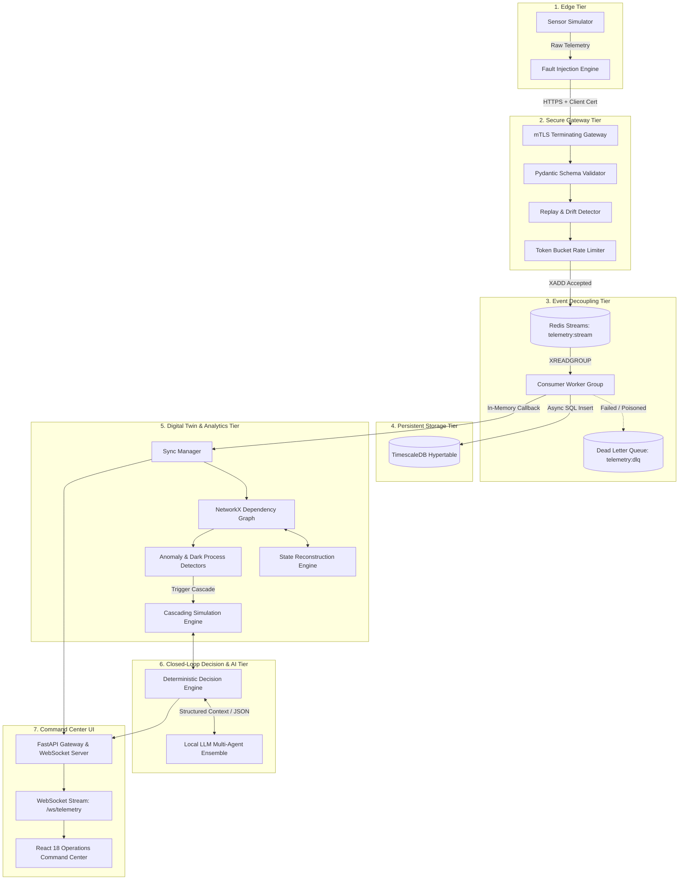

# NEXUS Data Flow Architecture

This document traces the path of data across all components, from physical sensor capture to presentation in the operations command center.

---

## High-Level Data Flow Diagram

---

## Step-by-Step Data Transformations

1. **Edge Generation & Degradation**:
   Measurements are captured in SI units (`pressure_psi`, `flow_rate_gpm`, `temperature_c`). The Fault Injection Engine selectively applies packet loss (0% to 40%), Gaussian noise, transmission jitter, or duplicate cloning.
2. **Gateway Ingestion & Sanitization**:
   The gateway checks client identity against Root CA, extracts the Common Name, verifies the device registry, sanitizes timestamps, checks sequence numbers, and validates physical coordinate bounds.
3. **Stream Buffering**:
   Accepted records are converted into Redis Stream field dictionaries and buffered with bounded length (`MAXLEN ~ 100000`).
4. **Time-Series Persistence**:
   The consumer worker formats payloads into SQLAlchemy model instances and flushes to TimescaleDB hypertables.
5. **Topological Graph Reflection**:
   The `TwinSyncManager` updates the node attributes in `InfrastructureTopology`. If fresh telemetry arrived, `state_source` is set to `OBSERVED` with confidence 1.0. If missing, `StateReconstructor` applies mass conservation ($\sum Q_{in} = \sum Q_{out}$) and head-loss gradients to infer physical state with exponential confidence decay $C(t) = e^{-\lambda \Delta t}$.
6. **Failure & Intervention Simulation**:
   When an asset fails, an isolated sandbox copy of the graph is created. Discrete-event steps simulate upstream starvation and downstream demand shortfalls.
7. **Decision Engine & Multi-Agent Deliberation**:
   Candidate interventions are generated from standard operating procedures (SOPs), tested against physical constraints, simulated in the sandbox, reviewed by the 5-role agentic AI ensemble, and broadcast to the dashboard.
