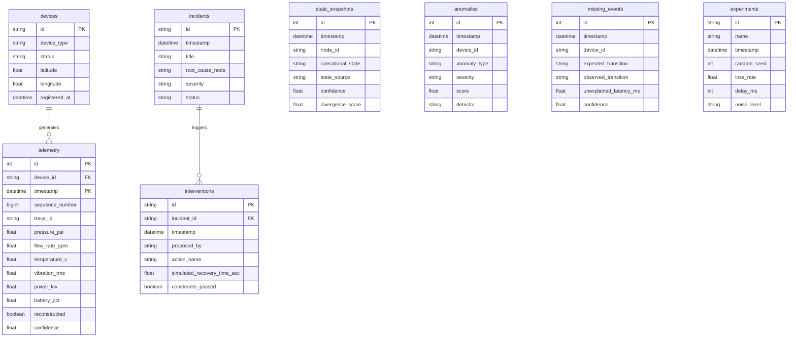

# Data Specification: Database Schema & TimescaleDB Strategy

NEXUS utilizes a hybrid storage model: relational schemas for assets, state snapshots, anomalies, and experiments alongside partitioned TimescaleDB hypertables for time-series telemetry.

---

## Entity-Relationship Overview

---

## Why Not Store Everything in One Table?
1. **Separation of Concerns**: Device inventory and topology metadata are rarely updated (low-velocity relational data), whereas telemetry arrives at thousands of events per second (high-velocity time-series).
2. **Hypertable Partitioning**: TimescaleDB optimizes tables partitioned strictly on `(timestamp, id)`. Placing non-time-series incident management inside the hypertable would bloat chunk index overhead.
3. **Auditability**: Isolating `state_snapshots`, `anomalies`, `missing_events`, and `interventions` allows independent historical auditing of decisions versus physical measurements.
