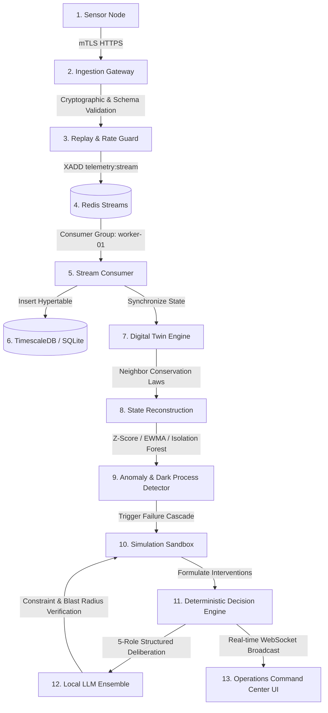

# How NEXUS Works — A Complete System Tour

This document traces the complete lifecycle of **one single telemetry measurement** through the closed-loop cyber-physical architecture of NEXUS.

By following this step-by-step walkthrough, you can understand how the entire system operates end-to-end without needing to read every line of source code.

---

## The Closed-Loop Spine



---

## Step 1: Telemetry Generation at the Sensor Node

### What is happening?
A smart physical asset (e.g. `pump_01`, a primary lift water pump) measures its operational parameters: hydraulic pressure (65.2 PSI), volumetric flow rate (52.4 GPM), motor temperature (21.0 °C), vibration RMS (0.42 mm/s), electrical power (19.5 kW), and battery status (98.5%).

### Why does it happen?
Cyber-physical systems cannot be controlled or analyzed without regular telemetry. In NEXUS, sensors report periodically (e.g., at 1 Hz).

### Which service performs it?
`simulator/device_simulator.py` via `SimulatedDevice` & `SensorFleetSimulator`.

### What data format is used?
JSON conforming to `gateway/schemas/telemetry.py:TelemetryPayload`:
```json
{
  "device_id": "pump_01",
  "timestamp": "2026-09-21T22:15:00.000Z",
  "sequence_number": 1042,
  "trace_id": "4b6e8284-90aa-4340-a19f-b77138374d75",
  "latitude": 43.541,
  "longitude": -80.248,
  "pressure_psi": 65.2,
  "flow_rate_gpm": 52.4,
  "temperature_c": 21.0,
  "vibration_rms": 0.42,
  "power_kw": 19.5,
  "battery_pct": 98.5,
  "schema_version": "1.0"
}
```

### Where does the data go next?
Sent as an HTTPS POST request with mutual TLS (mTLS) to the Secure Telemetry Gateway at `/api/v1/telemetry`.

### What can go wrong?
- Packet drop: Injected fault loss (up to 40%) drops the packet entirely before transmission.
- Noise: Sensor noise alters reading values.
- Network delay: Latency buffers delay the packet.

---

## Step 2: Ingestion & Authentication at the Gateway

### What is happening?
The Secure Gateway terminates the incoming connection, validates the client's X.509 cryptographic certificate against the NEXUS Root CA, extracts the `CommonName` (`pump_01`), and verifies device authorization.

### Why does it happen?
Telemetry networks are vulnerable to spoofing, rogue transmitter injection, and unauthorized data tampering. All edge devices must prove their cryptographic identity.

### Which service performs it?
`gateway/main.py` and `gateway/authentication/cert_validator.py`.

### What can go wrong?
- Untrusted Certificate: If signed by a rogue CA, the gateway returns `401 Unauthorized`.
- Revoked Asset: If marked `REVOKED` in the device registry, returns `403 Forbidden`.

---

## Step 3: Schema Validation, Replay Detection & Rate Limiting

### What is happening?
1. The gateway executes Pydantic schema validation (bounds checking: latitude, longitude, non-negative pressure).
2. The `TokenBucketRateLimiter` checks device quota (5,000 req/s capacity).
3. The `ReplayDetector` inspects `trace_id` and timestamp drift ($< 300\text{s}$ past, $< 60\text{s}$ future) and checks `sequence_number` monotonicity.

### Which service performs it?
`gateway/api/routes.py`, `gateway/api/rate_limiter.py`, `gateway/api/replay_detector.py`.

### What can go wrong?
- Duplicate Transmission: If the `trace_id` was already ingested, gateway returns `400 Bad Request`.
- Out-of-Order Packet: If sequence number is lower than observed maximum, the event is marked `DEGRADED` but processed.

---

## Step 4: Asynchronous Stream Decoupling via Redis Streams

### What is happening?
The validated payload is appended to the Redis Stream `nexus:telemetry:stream` via `XADD`. The gateway immediately returns an HTTP `202 Accepted` response with the Redis message ID.

### Why does it happen?
Decouples ingestion ingestion speed from database persistence and twin analytics. If database writes encounter momentary latency spikes, the gateway continues ingesting at full wire speed without dropping packets.

### Which service performs it?
`streaming/redis/producer.py:StreamProducer`.

### What can go wrong?
- Redis unavailable: Producer logs warning and engages in-memory queue fallback for offline test execution.

---

## Step 5: Consumer Group Stream Processing

### What is happening?
An asynchronous background worker (`worker-01`) belonging to consumer group `nexus:consumers:telemetry` reads the message via `XREADGROUP`, acknowledges it with `XACK`, and dispatches it to persistence and state synchronization.

### Which service performs it?
`streaming/consumers/telemetry_consumer.py`.

### What can go wrong?
- Poison Message / Deserialization Failure: If a message fails parsing, it is routed to the Dead Letter Queue (`nexus:telemetry:dlq`) so consumer processing does not deadlock.

---

## Step 6: Time-Series Persistence in TimescaleDB

### What is happening?
The telemetry reading is written to the `telemetry` table (a TimescaleDB hypertable partitioned into 7-day chunks).

### Which service performs it?
`database/queries/telemetry_repo.py` & `database/connection.py`.

### Why does it happen?
Provides historical auditability, baseline calculation for machine learning detectors, and long-term trend analysis.

---

## Step 7: Digital Twin In-Memory State Synchronization

### What is happening?
The `twin_sync_manager` updates the live in-memory digital twin node in the NetworkX dependency graph (`digital_twin/graph/topology.py`).
The node's physical attributes (`current_pressure`, `current_flow`, `battery_pct`) are updated, its state is marked `OBSERVED`, and its confidence is set to `1.0`.

### Why does it happen?
The digital twin represents operational cyber-physical reality, not just cold historical rows in a database.

---

## Step 8: State Reconstruction Under Incomplete Telemetry

### What is happening?
If subsequent telemetry packets for a node are dropped (e.g., during 40% packet loss experiments), the `StateReconstructor` evaluates:
1. $\Delta t \le 5\text{s}$: Still `OBSERVED`.
2. $5\text{s} < \Delta t \le 60\text{s}$: State transitions to `INFERRED`.
   Physical values are reconstructed from adjacent upstream and downstream nodes using hydraulic mass conservation ($\sum Q_{in} = \sum Q_{out}$) and pressure head-loss gradients.
   Bayesian confidence decays exponentially: $C(\Delta t) = e^{-\lambda \Delta t}$.
3. $\Delta t > 60\text{s}$: State transitions to `UNKNOWN`.

### Which service performs it?
`digital_twin/reconstruction/estimator.py`.

---

## Step 9: Anomaly & Dark Process Detection

### What is happening?
Two detection tiers evaluate the reading:
1. `StreamingStatisticalDetector`: Evaluates rolling Z-scores and checks for frozen sensor flatlines.
2. `MultivariateMLDetector`: Runs an Isolation Forest model over `[pressure, flow, temp, vibration, power]` to detect multi-variable anomalies (such as motor spinning at full power with zero flow, indicating impeller cavitation).
3. `DarkProcessDetector`: Evaluates state machine transitions. If a node jumps from `OPERATIONAL` directly to `EMERGENCY_SHUTDOWN` without an intermediate `ALERT`, it logs a Dark Process (unobserved missing event).

### Which service performs it?
`anomaly_detection/diagnostics/` & `anomaly_detection/missing_events/`.

---

## Step 10: Cascading Failure Simulation Sandbox

### What is happening?
If an anomaly or failure is confirmed (e.g. `pump_01` trips), the `CascadingSimulationEngine` creates an isolated sandbox copy of the topology graph and executes a discrete-event simulation:
- Step 0: Primary asset failure.
- Step 1: Upstream starvation trips downstream transmission pipes.
- Step 2: Distribution reservoir drains without replenishment.
- Step 3: Consumer districts suffer unserved demand.
The simulation measures total blast radius and time to equilibrium.

### Which service performs it?
`simulation/cascading_failures/engine.py`.

---

## Step 11: Deterministic Decision Engine & Constraint Solver

### What is happening?
The decision engine synthesizes candidate interventions:
1. `ACTIVATE_BACKUP_PUMP` (`pump_03`)
2. `OPEN_BYPASS_VALVE` (`valve_02`)
3. `ISOLATE_ZONE` (`valve_01`)
It checks hard physical constraints (cannot activate a failed pump; substation power capacity must not be exceeded).
It simulates each feasible intervention in the sandbox and computes:
$$\text{Score} = (\text{MitigatedAssets} \times 25.0) - (\text{RecoveryTime} \times 1.2)$$

### Which service performs it?
`agents/decision_support/engine.py`.

---

## Step 12: Local Agentic AI Ensemble (Ollama)

### What is happening?
The structured digital twin context is passed to a 5-role agentic AI ensemble:
1. **State Analyst**: Summarizes data quality and diagnostic condition.
2. **Risk Analyst**: Identifies cascading single-points-of-failure.
3. **Recovery Planner**: Formulates physical recovery strategies.
4. **Adversarial Critic**: Challenges the plan, searching for water-hammer pressure transients.
5. **Chief Evaluator**: Validates against simulated sandbox outcomes and produces final validated recommendation.
*Note: The LLM operates strictly in advisory capacity and cannot execute actions directly.*

### Which service performs it?
`agents/llm/client.py` & `agents/evaluation/multi_agent_workflow.py`.

---

## Step 13: Operations Command Center Visualization

### What is happening?
The state update, anomaly alert, and validated recommendation are broadcast over WebSocket (`/ws/telemetry`) to the React Command Center frontend.
The UI updates:
- Topological dependency graph colors nodes green/yellow/red/dashed cyan.
- Data completeness and observability gauges update in real time.
- The operator can inspect candidate interventions and observe the simulated recovery trajectory.

### Which service performs it?
`digital_twin/api.py` and `dashboard/src/App.tsx`.
